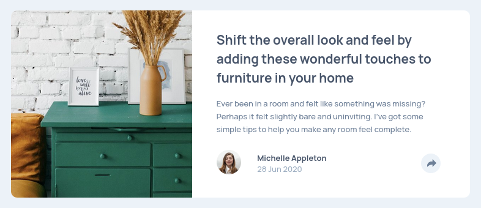

# Frontend Mentor - Article preview component solution

This is a solution to the [Article preview component challenge on Frontend Mentor](https://www.frontendmentor.io/challenges/article-preview-component-dYBN_pYFT). Frontend Mentor challenges help you improve your coding skills by building realistic projects.

## Table of contents

- [Overview](#overview)
  - [The challenge](#the-challenge)
  - [Screenshot](#screenshot)
  - [Links](#links)
- [My process](#my-process)
  - [Built with](#built-with)
  - [What I learned](#what-i-learned)
  - [Useful resources](#useful-resources)
- [Author](#author)

## Overview

### The challenge

Users should be able to:

- View the optimal layout for the component depending on their device's screen size
- See the social media share links when they click the share icon

### Screenshot



### Links

- Solution URL: [URL]()
- Live Site URL: [URL](https://lisviks.github.io/article-preview-component-frontendmentor/)

## My process

### Built with

- Semantic HTML5 markup
- Flexbox
- Mobile-first workflow

### What I learned

To change SVG color. Set SVG as a mask and then use background-color to change the color.

```html
<div class="svg"></div>
```

```css
.svg {
  mask: url(image.svg) no-repeat center;
  background-color: red;
}
```

### Useful resources

- [SVG styles](https://stackoverflow.com/a/43916743) - Helped me with changing share icons svg color.

## Author

- Website - [Deividas Rimkus](https://github.com/Lisviks)
- Frontend Mentor - [@Lisviks](https://www.frontendmentor.io/profile/Lisviks)
- Twitter - [@DRimkusDev](https://www.twitter.com/DRimkusDev)
